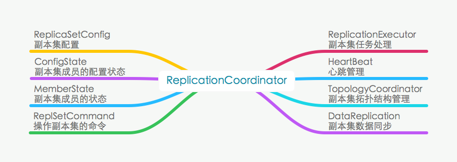

ReplSet 副本集Overview
===========================
### 副本集简介
mongodb作为一个分布式的nosql存储系统，其逃脱不了分布式存储绕不开的问题——可靠性。谈及存储的可靠性，从单机时代的文件系统到互联网时代的SAN/NAS再到如今的云存储，所采用的技术经历了RAID、副本和EC。RAID的理论知识可以说是一切可靠性技术的基础，后面应用广泛的副本和EC，可以说是RAID技术在新的场景下的演进。副本机制由于其实现相对简单，复杂度相对较低被广大开源的分布式系统所采用，其缺点是成本的增加。EC由于其复杂性，大多在一些商用的存储系统中使用。

Google GFS的论文一出基本上奠定了3副本机制在分布式存储系统的里的地位，现在比较热门的开源存储Ceph、HDFS、GlusterFS、Swift、SheepDog以及mongodb都采用了3副本的机制来保证可靠性。副本集指的是数据的三个副本所在的节点形成的一个集合，数据在该集合内是一致的。

### mongodb副本集剖析
与mongodb副本集实现相对应的核心抽象类为ReplicationCoordinator，实现类为ReplicationCoordinatorImpl。副本集实现的功能可以用以下图来概括：

